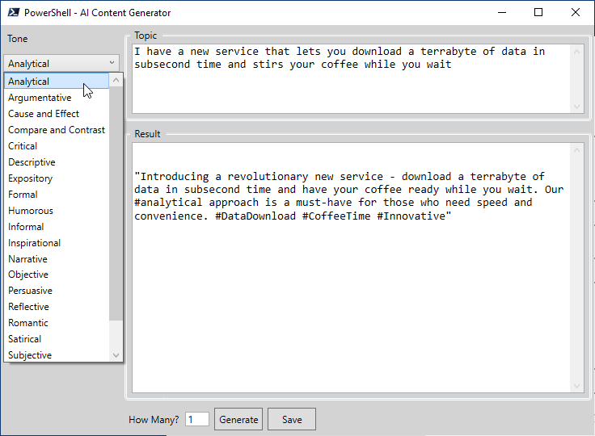

# Invoke-GenerateContent

Invoke-GenerateContent is a PowerShell script that uses Generative Pre-trained Transformer (GPT) to generate content for tweets, blogs, and YouTube descriptions. It provides a user interface (UI) to help you create prose in many different tones.

## Features

- Generate content for tweets, blogs, and YouTube descriptions
- Generate content in many different tones
- User-friendly UI
- Easy to use

## Requirements

- PowerShell 5.1 or higher

## Installation

1. Download (copy the content of) the Invoke-GenerateContent.ps1 script from the repository.
2. Open a PowerShell window and navigate to the directory where the script is located.
3. Run the script with the command `.\Invoke-GenerateContent.ps1`.

## Usage

1. After running the script, you will be presented with a UI.
2. Select the type of content you want to generate (tweet, blog, or YouTube description).
3. Select the tone of the content you want to generate.
4. Enter the text you want to use as a starting point

 

